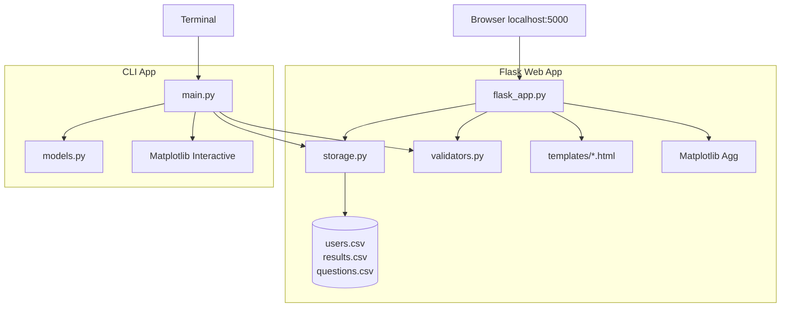

# Online Quiz System — Technical Project Documentation

> **Audit basis:** Every statement in this document is derived from direct inspection of the Python application codebase. Where design rationale is inferred (not stated in source code or README), it is labeled **(inferred)**. No features, dependencies, or machine learning components are invented.

---

## Table of Contents

1. [Executive Summary](#1-executive-summary)
2. [Repository Inventory](#2-repository-inventory)
3. [System Architecture](#3-system-architecture)
4. [Technology Stack](#4-technology-stack)
5. [Machine Learning & AI Components](#5-machine-learning--ai-components)
6. [Data Layer & Schemas](#6-data-layer--schemas)
7. [Module Reference (Inputs / Outputs / Behavior)](#7-module-reference-inputs--outputs--behavior)
8. [End-to-End Data Flows](#8-end-to-end-data-flows)
9. [Authentication & Authorization](#9-authentication--authorization)
10. [Presentation Layer](#10-presentation-layer)
11. [Deployment & Runtime](#11-deployment--runtime)
12. [Configuration & Environment](#12-configuration--environment)
13. [Edge Cases, Inconsistencies & Operational Risks](#13-edge-cases-inconsistencies--operational-risks)
14. [Senior Engineer Interview Questions](#14-senior-engineer-interview-questions)

---

## 1. Executive Summary

This repository implements an **Online Quiz System with performance analytics** as a Python application with **two entry points** sharing the same CSV-backed persistence layer:

| Surface | Entry Point | Persistence | Charting |
|---------|-------------|-------------|----------|
| **Flask Web App** | `python flask_app.py` → `http://localhost:5000` | `users.csv`, `results.csv`, `questions.csv` | Server-side Matplotlib (`Agg`) → Base64 PNG in HTML |
| **CLI App** | `python main.py` | Same CSV files | Interactive Matplotlib (`plt.show()`) |

**Roles:** `Student` and `Admin`. Admin credentials are hardcoded as `admin` / `admin` (documented in README and enforced in code).

**Core capabilities:**
- User registration, login, password update, account deletion (Students)
- Multiple-choice quiz taking with score persistence
- Per-student and global performance analytics (counts, averages, line/pie/bar charts)
- Admin question bank management and per-student metric drill-down

**Explicit non-features (verified absent from codebase):**
- No database (SQL/NoSQL)
- No REST/GraphQL API layer
- No automated test suite
- No machine learning models or predictive analytics
- No password hashing
- No environment-variable-based configuration (`.env` is gitignored but unused)

---

## 2. Repository Inventory

### 2.1 Python Application Layer

| File | Role |
|------|------|
| `flask_app.py` | Flask web server, routing, analytics rendering |
| `main.py` | Interactive CLI application |
| `storage.py` | CSV persistence abstraction |
| `models.py` | OOP user hierarchy (`User`, `QuizUser`, `Admin`) |
| `validators.py` | Input validation regex helpers |
| `requirements.txt` | Pinned Python dependencies |
| `README.md` | Setup instructions |

### 2.2 Flask Templates (`templates/`, 8 files)

| Template | Rendered By Route |
|----------|-------------------|
| `index.html` | `GET/POST /` (`login`) |
| `register.html` | `GET/POST /register` |
| `dashboard.html` | `GET /dashboard` |
| `student_metrics.html` | `GET /student/<username>` |
| `take_quiz.html` | `GET/POST /take_quiz` |
| `add_question.html` | `GET/POST /add_question` |
| `update_password.html` | `GET/POST /update_password` |
| `delete_account.html` | `GET/POST /delete_account` |

All templates use **inline `<style>` blocks** (no external CSS file in the Flask layer).

### 2.3 Data Files

| File | Current State (audit) | Used By |
|------|----------------------|---------|
| `users.csv` | Header only (`id,name,username,password`) — **0 users** | `storage.py` |
| `results.csv` | 9 quiz attempt records | `storage.py` |
| `questions.csv` | 11 Python quiz questions | `storage.py` |

### 2.4 Infrastructure

| File | Purpose |
|------|---------|
| `.gitignore` | Ignores `__pycache__/`, `*.pyc`, `.venv/`, `.env`, logs, OS files |

---

## 3. System Architecture

### 3.1 High-Level Architecture Diagram



### 3.2 Architectural Characteristics

**Layering (Flask):**
1. **Presentation:** Jinja2 templates with inline CSS
2. **Application:** Flask route handlers in `flask_app.py`
3. **Validation:** `validators.py` (partial — not all routes use all validators)
4. **Persistence:** `storage.py` → flat CSV files

**Layering (CLI):**
1. **Presentation:** stdin/stdout menus
2. **Application:** Functions in `main.py`
3. **Domain:** `models.py` (`QuizUser`, `Admin`)
4. **Persistence:** `storage.py` → same CSV files

**Coupling:** `storage.py` executes `init_files()` at **module import time** (line 138), creating CSV headers if missing. Any `import storage` triggers filesystem side effects.

**Separation:** `models.py` is used **only** by `main.py`. The Flask app does not import or use the OOP model classes.

---

## 4. Technology Stack

### 4.1 Python Dependencies (`requirements.txt`)

| Package | Version | Utilization | Rationale **(inferred)** |
|---------|---------|-------------|--------------------------|
| **Flask** | 2.3.3 | HTTP routing, Jinja2 templating, server-side sessions, flash messages, form parsing | Lightweight web framework for a monolithic app without a separate frontend build |
| **pandas** | 2.0.3 | `DataFrame` construction, `groupby`/`agg` for admin leaderboard, `to_html` for tables | Convenient tabular aggregation over CSV-derived dict rows |
| **numpy** | 1.24.3 | `np.arange` in `main.py` `show_student_chart()` only | Numeric array generation for Matplotlib bar chart x-positions |
| **matplotlib** | 3.7.2 | Line, pie, bar charts; Flask uses `Agg` + Base64; CLI uses `plt.show()` | Native Python charting without a JavaScript dependency |

**Standard library (no `requirements.txt` entry):**
- `csv`, `os` — `storage.py`
- `re` — `validators.py`
- `abc` — `models.py`
- `io`, `base64` — `flask_app.py` chart serialization

### 4.2 Frontend (Flask Templates)

| Technology | Utilization |
|------------|-------------|
| **Jinja2** | Conditionals, loops, `url_for`, `get_flashed_messages`, `| safe` on leaderboard HTML |
| **Inline CSS** | Per-template styling in each of the 8 templates |
| **Base64 inline images** | Charts embedded as `data:image/png;base64,{{ chart1 }}` |

### 4.3 What Is NOT in the Stack

Verified absent: `sklearn`, `tensorflow`, `torch`, `keras`, SQL drivers, Redis, Celery, Docker, `pytest`, `unittest`, Node.js, or any frontend framework.

---

## 5. Machine Learning & AI Components

**None present.**

"Performance analytics" refers exclusively to:
- **Descriptive statistics:** quiz counts, sum of correct/wrong answers, arithmetic mean of scores
- **Deterministic charting:** line charts (score per attempt), pie charts (correct vs wrong), bar charts (average score per student)

There is no model training, inference, or predictive logic in the repository.

---

## 6. Data Layer & Schemas

### 6.1 `users.csv`

```
id,name,username,password
```

| Field | Type (de facto) | Constraints |
|-------|-----------------|-------------|
| `id` | string (numeric) | Auto-incremented: `max(existing ids) + 1`, or `1` if empty |
| `name` | string | No server-side validation in Flask |
| `username` | string | `^[a-zA-Z0-9]{3,20}$` |
| `password` | string | Minimum 4 characters; stored **plaintext** |

### 6.2 `results.csv`

```
username,score,total
```

| Field | Type | Notes |
|-------|------|-------|
| `username` | string | Linked to `users.csv` by convention only |
| `score` | string (integer value) | Correct answers for one attempt |
| `total` | string (integer value) | Total questions in that attempt |

**Current data:** 9 rows for usernames `priyansu1`, `priyansu2`, `priyansu`, `abcd`, `priyansu123`.

### 6.3 `questions.csv`

```
question,opt1,opt2,opt3,opt4,answer
```

| Index (0-based) | Column | Usage |
|-----------------|--------|-------|
| 0 | `question` | Question text (may contain newlines) |
| 1–4 | `opt1`–`opt4` | Multiple-choice options |
| 5 | `answer` | **Correct answer text** (not option index) |

**Encoding:** `read_questions()` tries `utf-8`, falls back to `cp1252` on `UnicodeDecodeError`.

**Current data:** 11 Python programming questions.

### 6.4 Flask Server Session

Stored in a signed cookie (`app.secret_key = "quiz_secret_key"`):

| Key | Set When | Values |
|-----|----------|--------|
| `username` | Login | Student username or `"admin"` |
| `name` | Student login | Display name |
| `role` | Login | `"Student"` or `"Admin"` |

---

## 7. Module Reference (Inputs / Outputs / Behavior)

### 7.1 `storage.py`

**Side effect on import:** Calls `init_files()` to ensure `users.csv` and `results.csv` exist with headers.

| Function | Input | Output | Side Effects |
|----------|-------|--------|--------------|
| `init_files()` | None | None | Creates empty CSV files with headers if missing |
| `read_users()` | None | `list[dict]` | Reads `users.csv` |
| `write_users(users)` | list of user dicts | None | Overwrites `users.csv` |
| `find_user(username, password=None)` | username; optional password | user dict or `None` | If `password` is `None`, matches username only |
| `register_user(name, username, password)` | strings | `bool` | Returns `False` on duplicate username |
| `change_password(username, new_password)` | strings | `bool` | Updates password in place |
| `remove_user(username)` | string | None | Deletes user and all their results |
| `read_results(username=None)` | optional filter | `list[dict]` | Returns `[]` if file missing |
| `write_results(results)` | list | None | Overwrites `results.csv` |
| `add_result(username, score, total)` | strings/ints | None | Appends one result row |
| `read_questions()` | None | `list[list]` (6-element rows) | Skips header; requires `len(row) >= 6` |
| `add_question(q, o1, o2, o3, o4, answer)` | strings | None | Appends to `questions.csv` |

**Write pattern:** Full-file rewrite for users and results. Questions use append-only.

### 7.2 `validators.py`

| Function | Input | Output | Rule |
|----------|-------|--------|------|
| `validate_username(username)` | string | `bool` | `^[a-zA-Z0-9]{3,20}$` |
| `validate_password(password)` | string | `bool` | `^.{4,}$` |
| `validate_answer(ans)` | string | `bool` | `^[1-4]$` after strip |

**Usage:** `validate_answer` is called **only** in `main.py`, not in Flask routes.

### 7.3 `models.py`

| Class | Constructor | Used By |
|-------|-------------|---------|
| `User` (ABC) | `(uid, name, username)` | Subclasses |
| `QuizUser` | `(uid, name, username)` | `main.py` `login()` |
| `Admin` | Hardcodes uid=0, username=`admin`, password=`admin` | `main.py` admin login |

**Note:** `QuizUser.total_quizzes` is initialized to `0` and never incremented.

### 7.4 `flask_app.py`

#### Helper Functions

| Function | Input | Output |
|----------|-------|--------|
| `plot_to_base64(fig)` | Matplotlib figure | Base64 PNG string |
| `get_student_df(username)` | username | `pd.DataFrame` or `None` |

#### Routes

| Route | Methods | Auth | POST Fields | Output |
|-------|---------|------|-------------|--------|
| `/` | GET, POST | Public | `username`, `password` | `index.html` or redirect |
| `/register` | GET, POST | Public | `name`, `username`, `password` | `register.html` or redirect |
| `/dashboard` | GET | Session | — | `dashboard.html` (role-specific) |
| `/student/<username>` | GET | Admin | — | `student_metrics.html` |
| `/take_quiz` | GET, POST | Student | `q_0`…`q_N` (option text) | `take_quiz.html` or redirect |
| `/add_question` | GET, POST | Admin | `question`, `opt1`–`opt4`, `answer` (1–4) | `add_question.html` or redirect |
| `/update_password` | GET, POST | Student | `new_password` | `update_password.html` or redirect |
| `/delete_account` | GET, POST | Student | `confirm` (`yes`/`no`) | `delete_account.html` or redirect |
| `/logout` | GET | Any | — | Clears session → redirect `/` |

#### Quiz Scoring (Flask)

```python
for i, q in enumerate(questions):
    ans = request.form.get(f"q_{i}", "").strip()
    if ans == q[5].strip():
        score += 1
```

Submitted radio **value** is option text; compared to answer text in `q[5]`.

### 7.5 `main.py` (CLI)

| Function | Purpose |
|----------|---------|
| `register()` | stdin registration |
| `login()` | stdin login → `QuizUser` or `None` |
| `update_password(user)` | stdin password change |
| `delete_account(user)` | stdin confirmation |
| `get_scores(username)` | `pd.DataFrame` or `None` |
| `show_stats(username)` | Prints aggregate stats |
| `show_line_chart(username)` | Interactive line chart |
| `show_pie_chart(username)` | Interactive pie chart |
| `start_quiz()` | Returns `(score, total)` |
| `add_question()` | stdin → appends to CSV |
| `view_all_students()` | Prints all result rows |
| `show_student_chart()` | Bar chart of avg score per student |
| `view_student_metrics()` | Pick student; stats + charts |
| `student_menu(user)` | Menu options 1–7 |
| `admin_menu()` | Menu options 1–5 |
| `main()` | Top-level: Register / Login / Admin / Exit |

#### Quiz Scoring (CLI — differs from Flask)

```python
if row[int(ans)].strip() == row[5].strip():
    score += 1
```

User enters option **index** (1–4); code compares option text at that index to answer text.

---

## 8. End-to-End Data Flows

### 8.1 Student Registration (Flask)

```
POST /register {name, username, password}
  → validate_username/password
  → storage.register_user() → users.csv
  → flash → redirect GET /
```

### 8.2 Login (Flask)

```
POST / {username, password}
  → IF admin/admin → session {role: Admin}
  → ELSE storage.find_user() → session {username, name, role: Student}
  → redirect GET /dashboard
```

### 8.3 Take Quiz (Flask)

```
GET /take_quiz → read_questions() → render take_quiz.html
POST /take_quiz → score each answer → add_result() → results.csv → redirect /dashboard
```

### 8.4 Admin Dashboard (Flask)

```
GET /dashboard (Admin)
  → read_results() + read_users()
  → pandas groupby → leaderboard
  → matplotlib bar chart → base64 PNG
  → render dashboard.html
```

### 8.5 Admin View Student Metrics (CLI)

```
admin_menu option 3 → view_student_metrics()
  → read_users() → pick by number
  → get_scores() → print stats → line chart → pie chart
```

---

## 9. Authentication & Authorization

### 9.1 Admin Credentials

| Surface | Mechanism | Location |
|---------|-----------|----------|
| Flask | String comparison in `login()` | `flask_app.py` lines 39–42 |
| CLI | `Admin()` class + comparison | `main.py` lines 337–340; `models.py` lines 31–34 |

**Credential:** `admin` / `admin`

### 9.2 Role-Based Access Control (Flask)

| Route | Student | Admin | Unauthenticated |
|-------|---------|-------|-----------------|
| `/take_quiz` | Allowed | Redirect `/` | Redirect `/` |
| `/add_question` | Redirect `/` | Allowed | Redirect `/` |
| `/update_password` | Allowed | Redirect `/` | Redirect `/` |
| `/delete_account` | Allowed | Redirect `/` | Redirect `/` |
| `/student/<username>` | Redirect `/` | Allowed | Redirect `/` |
| `/dashboard` | Allowed | Allowed | Redirect `/` |

### 9.3 Security Posture

| Topic | Implementation |
|-------|----------------|
| Password storage | Plaintext in CSV |
| Session | Signed cookie; hardcoded `secret_key` |
| CSRF | None |
| XSS risk | Leaderboard uses `| safe` on pandas HTML |
| Rate limiting | None |

---

## 10. Presentation Layer

### 10.1 Flask Template Variables

**`dashboard.html`:**
- Always: `role`, `username`
- `empty=True`: no analytics
- Student + data: `quizzes`, `correct`, `wrong`, `avg`, `chart1`, `chart2`
- Admin + data: `leaderboard` (HTML), `chart1`, `questions`
- Admin + no results: `empty=True`, `questions` still shown

**`take_quiz.html`:** `questions` — `q[0]` question, `q[1]`–`q[4]` options, `q[5]` answer

**`student_metrics.html`:** `username`, `name`, `empty`, stats + chart vars

### 10.2 Design Tokens (inline CSS across templates)

| Token | Value |
|-------|-------|
| Background | `#f4f7f6` |
| Primary blue | `#4a90e2` |
| Success green | `#27ae60` |
| Warning orange | `#f39c12` |
| Danger red | `#e74c3c` |
| Heading | `#2c3e50` |
| Font | `"Segoe UI", Tahoma, Geneva, Verdana, sans-serif` |

### 10.3 Chart Y-Axis Assumption

Matplotlib sets `ax.set_ylim(0, 10)` on admin bar charts. This matches current data (all `total` values are `10`) but is **not computed** from actual question count.

---

## 11. Deployment & Runtime

### 11.1 Flask (Web)

```bash
pip install -r requirements.txt
python flask_app.py
```

- Runs on port `5000` with `debug=True`
- Requires write access to CSV files in project root

### 11.2 CLI (Terminal)

```bash
python main.py
```

- Interactive menus via stdin/stdout
- Matplotlib opens native chart windows

---

## 12. Configuration & Environment

| Config Item | Value | Location |
|-------------|-------|----------|
| Flask secret key | `"quiz_secret_key"` | `flask_app.py:14` |
| Flask debug | `True` | `flask_app.py:293` |
| Flask port | `5000` | `flask_app.py:293` |
| Matplotlib backend | `"Agg"` (Flask only) | `flask_app.py:4` |
| CSV directory | Same dir as `storage.py` | `storage.py:4-7` |

**`.env`:** Listed in `.gitignore` but not read by any module.

---

## 13. Edge Cases, Inconsistencies & Operational Risks

### 13.1 Flask vs CLI Differences

| Behavior | Flask | CLI |
|----------|-------|-----|
| Quiz answer input | Radio value = option text | Stdin index 1–4 |
| Scoring | `ans == q[5]` | `row[int(ans)] == row[5]` |
| User models | Not used | `QuizUser`, `Admin` |
| `validate_answer` | Not used | Used |
| Charts | Server PNG in HTML | Desktop window |

### 13.2 Data Integrity Risks

1. **No transactional writes:** Concurrent Flask requests can race on CSV read-modify-write.
2. **Orphan results:** `results.csv` has usernames not in `users.csv`.
3. **Full file rewrite:** Every user/result mutation rewrites the entire CSV.
4. **Append-only questions:** No deduplication or validation on `add_question`.

### 13.3 Empty-State Handling (Flask)

| Scenario | Behavior |
|----------|----------|
| No quiz results (Student) | `empty=True` empty state on dashboard |
| No quiz results (Admin) | `empty=True` but question bank still shown |
| No questions | `/take_quiz` flashes error, redirects dashboard |
| Student not found (Admin metrics) | Flash + redirect dashboard |

### 13.4 Other Edge Cases

- `read_questions()` encoding fallback: `utf-8` → `cp1252`
- Delete account with `confirm != "yes"`: redirects dashboard, no flash
- `import storage` always triggers `init_files()` filesystem side effect

---

## 14. Senior Engineer Interview Questions

### Architecture & Design

1. **Why does `models.py` exist for the CLI but is unused by Flask? How would you unify the domain model?**
2. **`storage.py` initializes files at import time. What problems does this cause for testing and packaging?**
3. **CSV is the persistence layer. At what scale does this break, and what would you migrate to first?**

### Data & Persistence

4. **How would you prevent lost updates when two Flask requests write `users.csv` concurrently?**
5. **`results.csv` has usernames with no `users.csv` entry. Bug or acceptable? How would you enforce integrity?**
6. **Questions are append-only. How would you implement edit/delete without changing the CSV format?**

### Security

7. **Passwords are plaintext in CSV. Walk through a bcrypt migration plan.**
8. **The `secret_key` is hardcoded. What attacks does this enable in production?**
9. **No CSRF on Flask forms. Demonstrate an attack and propose a fix.**
10. **Leaderboard HTML uses `| safe`. When could student names become an XSS vector?**

### Application Logic

11. **CLI and Flask score quizzes differently (index vs text). When do they disagree?**
12. **Chart y-axis is hardcoded to 0–10. What breaks when an admin adds 15 questions?**
13. **Flask `take_quiz` skips `validate_answer`. Can a malformed POST affect scoring?**

### Scalability & Performance

14. **Admin dashboard loads all results on every request. Complexity and pagination strategy?**
15. **Matplotlib runs synchronously in the request path. How would you offload it?**

### Testing & Quality

16. **No automated tests exist. What is the minimum test pyramid, and which module do you test first?**
17. **How do you integration-test the quiz flow without mutating production CSV files?**

### System Design

18. **Would you expose `storage.py` behind a REST API or replace CSV with SQLite for a mobile client?**
19. **How would you add timed quizzes or question randomization keeping the same CSV schema?**
20. **Two simultaneous registrations for the same username — describe the race in the current code.**

---

## Appendix A: Flask Route Map

| URL | Handler | Template |
|-----|---------|----------|
| `/` | `login()` | `index.html` |
| `/register` | `register()` | `register.html` |
| `/dashboard` | `dashboard()` | `dashboard.html` |
| `/student/<username>` | `student_metrics()` | `student_metrics.html` |
| `/take_quiz` | `take_quiz()` | `take_quiz.html` |
| `/add_question` | `add_question()` | `add_question.html` |
| `/update_password` | `update_password()` | `update_password.html` |
| `/delete_account` | `delete_account()` | `delete_account.html` |
| `/logout` | `logout()` | redirect |

## Appendix B: Python Dependency Graph

```
flask_app.py → storage.py, validators.py, flask, pandas, matplotlib
main.py      → storage.py, models.py, validators.py, pandas, numpy, matplotlib
storage.py   → csv, os
models.py    → abc
validators.py → re
```

---

*Document scoped to the Python Flask + CLI application. No synthetic features or dependencies were added.*