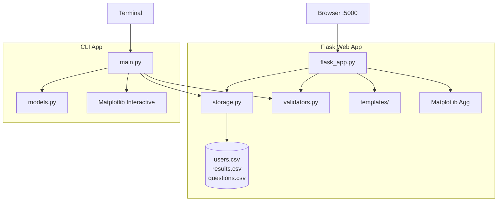

# Online Quiz System — Technical Project Documentation

> **Audit basis:** Every statement is derived from direct inspection of the repository. Inferred rationale is marked **(inferred)**. No features, dependencies, or machine learning components are invented.

---

## Table of Contents

1. [Executive Summary](#1-executive-summary)
2. [Repository Inventory](#2-repository-inventory)
3. [System Architecture](#3-system-architecture)
4. [Technology Stack & Rationale](#4-technology-stack--rationale)
5. [Machine Learning & AI](#5-machine-learning--ai)
6. [Data Layer & Schemas](#6-data-layer--schemas)
7. [Module Reference](#7-module-reference)
8. [Flask Application Reference](#8-flask-application-reference)
9. [CLI Application Reference](#9-cli-application-reference)
10. [Flask Templates Reference](#10-flask-templates-reference)
11. [End-to-End Data Flows](#11-end-to-end-data-flows)
12. [Authentication & Authorization](#12-authentication--authorization)
13. [Configuration & Runtime](#13-configuration--runtime)
14. [Edge Cases & Operational Risks](#14-edge-cases--operational-risks)
15. [Senior Engineer Interview Questions](#15-senior-engineer-interview-questions)
16. [Appendices](#16-appendices)

---

## 1. Executive Summary

The **Online Quiz System** is a Python application with **two entry points** sharing CSV-backed persistence:

| Surface | Entry | Persistence | Charting |
|---------|-------|-------------|----------|
| **Flask Web App** | `python flask_app.py` → `http://localhost:5000` | `users.csv`, `results.csv`, `questions.csv` | Matplotlib `Agg` → Base64 PNG in HTML |
| **CLI App** | `python main.py` | Same CSV files | Interactive Matplotlib (`plt.show()`) |

**Roles:** `Student` and `Admin`. Admin credentials: `admin` / `admin` (README + hardcoded in code).

**Capabilities:** registration, login, password update, account deletion, quizzes, descriptive analytics (counts, averages, line/pie/bar charts), admin question management, per-student metrics.

**Verified absences:** no database, no REST API, no tests, no ML, no password hashing, no `.env` usage.

---

## 2. Repository Inventory

### Python Core (7)

| File | Role |
|------|------|
| `flask_app.py` | Flask server, routes, charts |
| `main.py` | CLI menus |
| `storage.py` | CSV persistence |
| `models.py` | `User`, `QuizUser`, `Admin` (CLI only) |
| `validators.py` | Input validation |
| `requirements.txt` | Dependencies |
| `README.md` | Setup instructions |

### Data (3)

| File | State |
|------|-------|
| `users.csv` | Header only — 0 users |
| `results.csv` | 9 attempt rows |
| `questions.csv` | 11 Python quiz questions |

### Flask Templates (8)

`index.html`, `register.html`, `dashboard.html`, `student_metrics.html`, `take_quiz.html`, `add_question.html`, `update_password.html`, `delete_account.html` — all inline CSS.

### Infrastructure (2)

| File | Role |
|------|------|
| `.gitignore` | Ignores cache, venv, `.env`, logs |
| `PROJECT_DOCUMENTATION.md` | This file |

---

## 3. System Architecture



**Layering (Flask):** Jinja2 templates → route handlers → validators → `storage.py` → CSV.

**Layering (CLI):** stdin menus → `main.py` → `models.py` / validators → `storage.py` → CSV.

**Coupling:** `import storage` triggers `init_files()` (line 138). `models.py` is unused by Flask.

---

## 4. Technology Stack & Rationale

| Package | Version | Usage | Rationale **(inferred)** |
|---------|---------|-------|--------------------------|
| Flask | 2.3.3 | Routing, sessions, templates, forms | Lightweight monolithic web app |
| pandas | 2.0.3 | DataFrames, groupby, `to_html` | Tabular analytics over CSV rows |
| numpy | 1.24.3 | `np.arange` in CLI bar chart only | Bar chart x-positions |
| matplotlib | 3.7.2 | Line/pie/bar charts | Server PNG (Flask) or desktop (CLI) |

**Stdlib:** `csv`, `os` (`storage.py`); `re` (`validators.py`); `abc` (`models.py`); `io`, `base64` (`flask_app.py`).

**Not present:** sklearn, SQL drivers, pytest, Docker, Node.js, bcrypt, Flask-WTF.

---

## 5. Machine Learning & AI

**None.** Analytics = descriptive stats + static charts only.

---

## 6. Data Layer & Schemas

### `users.csv` — `id,name,username,password`

- `id`: auto-increment string
- `username`: `^[a-zA-Z0-9]{3,20}$`
- `password`: min 4 chars, plaintext

### `results.csv` — `username,score,total`

- One row per quiz attempt; 9 rows in repo (all `total=10`)

### `questions.csv` — `question,opt1,opt2,opt3,opt4,answer`

- `answer` column stores **answer text**, not index
- Encoding: utf-8, fallback cp1252
- 11 questions

### Flask session (signed cookie, `secret_key`)

| Key | Value |
|-----|-------|
| `username` | Student username or `admin` |
| `name` | Student display name |
| `role` | `Student` or `Admin` |

---

## 7. Module Reference

### `storage.py`

| Function | In | Out | Effect |
|----------|----|-----|--------|
| `init_files()` | — | — | Create CSV headers if missing |
| `read_users()` | — | list[dict] | Read users.csv |
| `write_users(users)` | list | — | Overwrite users.csv |
| `find_user(username, password=None)` | str | dict/None | Optional password check |
| `register_user(...)` | str×3 | bool | False on duplicate |
| `change_password(...)` | str×2 | bool | Update password |
| `remove_user(username)` | str | — | Delete user + results |
| `read_results(username=None)` | str? | list | Filter optional |
| `write_results(results)` | list | — | Overwrite results.csv |
| `add_result(...)` | str,int,int | — | Append attempt |
| `read_questions()` | — | list[list] | 6+ column rows |
| `add_question(...)` | str×6 | — | Append to questions.csv |

### `validators.py`

| Function | Rule | Used in |
|----------|------|---------|
| `validate_username` | `^[a-zA-Z0-9]{3,20}$` | Flask register, CLI register |
| `validate_password` | `^.{4,}$` | Flask + CLI |
| `validate_answer` | `^[1-4]$` | CLI quiz only |

### `models.py`

| Class | Used by |
|-------|---------|
| `User` (ABC) | Subclasses |
| `QuizUser` | `main.login()` |
| `Admin` (hardcoded admin/admin) | `main` admin login |

---

## 8. Flask Application Reference

### Routes

| Route | Methods | Auth | POST fields |
|-------|---------|------|-------------|
| `/` | GET,POST | — | username, password |
| `/register` | GET,POST | — | name, username, password |
| `/dashboard` | GET | session | — |
| `/student/<username>` | GET | Admin | — |
| `/take_quiz` | GET,POST | Student | q_0…q_N (option text) |
| `/add_question` | GET,POST | Admin | question, opt1-4, answer (1-4) |
| `/update_password` | GET,POST | Student | new_password |
| `/delete_account` | GET,POST | Student | confirm |
| `/logout` | GET | — | — |

### Quiz scoring

```python
if request.form.get(f"q_{i}", "").strip() == q[5].strip(): score += 1
```

### Admin analytics

`groupby` → attempts + mean score → `to_html(escape=False)` → bar chart ylim 0–10.

### Runtime

`debug=True`, port `5000`, Matplotlib backend `Agg`.

---

## 9. CLI Application Reference

**Menus:** main (Register/Login/Admin/Exit) → student (7 options) or admin (5 options).

**Quiz scoring (differs from Flask):**

```python
if row[int(ans)].strip() == row[5].strip(): score += 1
```

User enters index 1–4; code compares option text at that index to answer text.

---

## 10. Flask Templates Reference

| Template | Key variables |
|----------|---------------|
| `dashboard.html` | role, username, empty, stats/charts or leaderboard |
| `take_quiz.html` | questions — radio values = option text |
| `student_metrics.html` | name, username, stats, chart1/2 |
| Others | Standard forms + flash messages |

Design: bg `#f4f7f6`, primary `#4a90e2`, Segoe UI font stack.

---

## 11. End-to-End Data Flows

**Register:** POST /register → validators → register_user → users.csv

**Login:** POST / → find_user or admin check → session → /dashboard

**Quiz:** GET /take_quiz → read_questions → POST → score → add_result → results.csv

**Admin dashboard:** read_results + groupby + matplotlib → dashboard.html

---

## 12. Authentication & Authorization

| Route | Student | Admin | None |
|-------|---------|-------|------|
| /take_quiz | ✓ | → / | → / |
| /add_question | → / | ✓ | → / |
| /update_password | ✓ | → / | → / |
| /delete_account | ✓ | → / | → / |
| /student/<u> | → / | ✓ | → / |

**Security facts:** plaintext passwords, hardcoded secret_key, no CSRF, `| safe` on leaderboard, debug=True.

---

## 13. Configuration & Runtime

| Setting | Value | File |
|---------|-------|------|
| secret_key | `quiz_secret_key` | flask_app.py:14 |
| debug | True | flask_app.py:293 |
| port | 5000 | flask_app.py:293 |
| CSV path | dirname(storage.py) | storage.py:4-7 |

```bash
pip install -r requirements.txt
python flask_app.py    # web
python main.py         # CLI
```

---

## 14. Edge Cases & Operational Risks

1. **Scoring divergence:** CLI uses index; Flask uses option text.
2. **CSV races:** no file locking on concurrent writes.
3. **Orphan results:** 9 results, 0 users in users.csv.
4. **Chart y-axis:** hardcoded 0–10, not tied to question count.
5. **import storage:** always runs init_files().
6. **validate_answer:** not used in Flask take_quiz.

---

## 15. Senior Engineer Interview Questions

1. Why is `models.py` CLI-only? How to unify domain models?
2. CSV persistence — when does it break? First migration target?
3. Prevent lost updates on concurrent register_user calls?
4. Plaintext passwords — bcrypt migration plan?
5. Hardcoded secret_key — production risk?
6. CSRF attack on Flask forms — fix?
7. CLI vs Flask scoring — when do they disagree?
8. ylim(0,10) — what breaks with 15 questions?
9. Admin dashboard full-scan — pagination strategy?
10. Synchronous matplotlib in request path — offload approach?
11. No tests — minimum pyramid starting where?
12. Integration test quiz flow without mutating CSV?
13. REST API over storage.py vs SQLite for mobile client?
14. Timed quizzes without CSV schema change?
15. Duplicate username race in register_user?

---

## 16. Appendices

### A. Flask Route Map

| URL | Handler | Template |
|-----|---------|----------|
| / | login | index.html |
| /register | register | register.html |
| /dashboard | dashboard | dashboard.html |
| /student/<username> | student_metrics | student_metrics.html |
| /take_quiz | take_quiz | take_quiz.html |
| /add_question | add_question | add_question.html |
| /update_password | update_password | update_password.html |
| /delete_account | delete_account | delete_account.html |
| /logout | logout | redirect |

### B. Import Graph

```
flask_app.py → storage, validators, flask, pandas, matplotlib
main.py      → storage, models, validators, pandas, numpy, matplotlib
storage.py   → csv, os
models.py    → abc
validators.py → re
```

### C. requirements.txt

```
Flask==2.3.3
pandas==2.0.3
numpy==1.24.3
matplotlib==3.7.2
```

---

*Scoped to Flask + CLI Python application. Generated from repository audit.*